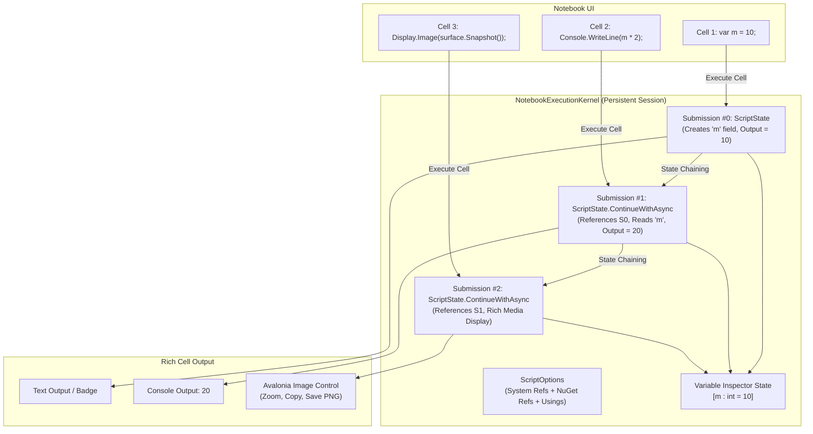

# FryPDF C# Code Studio Plugin (`com.frypdf.plugin.csharpeditor`)

An interactive in-app C# development and script automation studio for **FryPDF** (.NET 10 cross-platform document studio).

Inspired by [arklumpus/CSharpEditor](https://github.com/arklumpus/CSharpEditor), this plugin provides a dual-page workflow:
1. **Script Management Hub**: Organize, create, search, and duplicate scripts with a starter template gallery.
2. **Dedicated C# Code Studio**: Rich code editor powered by `Avalonia.AvaloniaEdit`, real-time Roslyn diagnostics, and in-memory execution with live console output redirection.

---

## 🌟 Key Features

- **Two-Page Architecture**:
  - **Management Hub**: Browse saved scripts, view LOC statistics, search by tags, and spawn scripts from starter templates.
  - **Code Editor Studio**: Full-screen coding workspace with run/stop controls, error navigation, and console output.
- **Hardware-Accelerated Code Editor**:
  - Powered by `Avalonia.AvaloniaEdit 12.0.0` with full C# syntax highlighting, line numbers, word wrap, and dark code palette.
- **Real-Time Roslyn Diagnostics**:
  - Debounced (350ms) background analysis via `Microsoft.CodeAnalysis.CSharp`.
  - "Problems" drawer with error/warning counts, line/column coordinates, and click-to-jump navigation.
- **In-Memory Script Execution**:
  - Dynamic compilation into memory stream (`CSharpCompilation.Emit`).
  - Isolated loading via collectible `AssemblyLoadContext`.
  - Captures `Console.Out` and `Console.Error` to a live terminal viewer with execution duration timing.
  - User cancellation and timeout protection.
- **Starter Template Library**:
  - Hello World Console
  - PDF Document Automation & Inspection
  - LINQ & Allocation High-Performance Benchmark
  - JSON Serialization with `System.Text.Json`
- **Zero Overlay / Full-Viewport Workspace**:
  - Mounts directly into FryPDF's left sidebar navigation as a dedicated full-viewport workspace studio page.
  - Deep integration with Command Palette (`Ctrl+Alt+E`), Status Bar (`{ } C# Studio`), and Ribbon Plugins Tab.

---

## 🚀 Instant F5 Standalone Testing

You can develop, test, and debug the plugin without running the main FryPDF application:

1. Open `examples/CSharpEditorPlugin/CSharpEditorPlugin.slnx` in Rider or Visual Studio.
2. Set `CSharpEditorPlugin.Runner` as the startup project.
3. Hit **Run (F5)**!

Or run from terminal:
```bash
dotnet run --project examples/CSharpEditorPlugin/Runner/CSharpEditorPlugin.Runner.csproj
```

---

## 📦 Building & Packaging

To compile and package the release `.fryplugin` distribution archive:

```bash
# Automated packaging CLI
python3 tools/package_plugin.py CSharpEditor
```

The output `CSharpEditor.fryplugin` will be generated and staged in `plugins/com.frypdf.plugin.csharpeditor/`.

## Architecture: How Jupyter / .NET Interactive Stateful Execution Works

