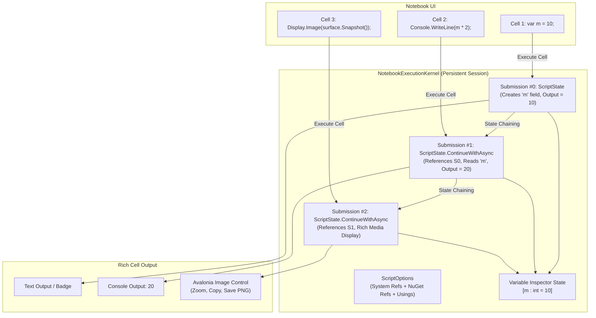

# CSharpPlayground (FrySharp)

[](https://github.com/PrashantUnity/CSharpPlayground/actions/workflows/ci.yml)
[](LICENSE)
[](https://dotnet.microsoft.com/)
[](https://avaloniaui.net/)

**CSharpPlayground** (standalone executable: **FrySharp**) is an interactive C# code studio, interactive Jupyter-style notebook environment, and script automation engine for .NET 10 and Avalonia UI.

It operates both as:
1. **A Standalone Desktop Application (`FrySharp`)**: Native desktop app for macOS (`.dmg`) and Windows (`.msix` / `.exe` installer) with an authentic VS Code-inspired 5-zone IDE layout.
2. **A FryPDF Ecosystem Plugin (`com.frypdf.plugin.csharpeditor`)**: Edge-to-edge full-viewport workspace studio and document automation plugin for FryPDF.

---

## 🌟 Key Features

- **Authentic VS Code Layout & Ergonomics**:
  - **Activity Bar**: Explorer, Search, Run & Debug, NuGet Package Manager, Scratchpad, and Problems badges.
  - **Primary Side Bar**: File tree, project explorer, and script management hub.
  - **Multi-Tab Editor**: Smooth horizontal tab bar with dirty indicators (`●`), quick close, and isolated execution states.
  - **Bottom Tool Deck**: Roslyn Problems, Output, Terminal Console, Debug REPL, and Rich Results.
  - **Status Bar**: Execution timer (`⏱ 14ms`), line/column coordinates, spaces, UTF-8, and compiler status.
- **Interactive Jupyter-Style C# Notebooks**:
  - Stateful cell execution kernel chaining submissions using Roslyn Scripting API.
  - NuGet package resolution directly in scripts (`#r "nuget: ..."`).
  - Rich output display: text, images, charts, and custom Avalonia controls (`Display.Image(...)`, `Display.Control(...)`).
  - Cell input/output collapsing, folding, and export.
- **Tabular Data Analytics**:
  - Native display and profiling for `DataTable`, `DataView`, and Microsoft.Data.Analysis `DataFrame`.
  - Column summaries, data types, row counts, and inline search.
- **Real-Time Roslyn Diagnostics**:
  - Debounced (350ms) background analysis via `Microsoft.CodeAnalysis.CSharp`.
  - "Problems" drawer with error/warning counts, line/column coordinates, and click-to-jump navigation.
- **Interactive Debugging**:
  - Visual gutter breakpoints, line highlighting, and stepping controls (F5 Continue, F10 Step Over, F11 Step Into, Shift+F5 Stop).
  - Variable inspector and immediate REPL evaluation.

---

## 🚀 Quick Start

### Prerequisites
- [.NET 10 SDK](https://dotnet.microsoft.com/download)

### Run Standalone Desktop App (FrySharp)
```bash
# Clone the repository
git clone https://github.com/PrashantUnity/CSharpPlayground.git
cd CSharpPlayground

# Run standalone desktop app
dotnet run --project Runner/CSharpEditorPlugin.Runner.csproj
```

### Run Automated Unit Tests
```bash
# Run all 244 unit tests
dotnet test CSharpEditorPlugin.slnx
```

---

## 📦 Solution Structure

```
CSharpPlayground/
├── CSharpEditorPlugin.slnx         # Modern XML solution (Engine + Runner + Tests)
├── CSharpEditorPlugin.csproj       # Core Studio & Plugin library (.NET 10)
├── CSharpEditorPlugin.cs           # IFryPlugin entrypoint
├── plugin.json                     # FryPDF marketplace manifest
├── Controls/                       # VS Code activity bar, status bar, tabs, editor
├── Models/                         # POCO models for scripts, cells, diagnostics
├── Services/                       # Roslyn compiler, kernel, completion, debugger
├── ViewModels/                     # Reactive MVVM view models
├── Views/                          # Avalonia XAML views (Studio, Notebook, Manager)
├── Runner/                         # Standalone desktop executable (FrySharp)
│   ├── CSharpEditorPlugin.Runner.csproj
│   ├── Program.cs / App.axaml
│   └── MainWindow.axaml
├── Tests/                          # Comprehensive xUnit test suite (244 tests)
│   └── CSharpEditorPlugin.Tests.csproj
└── packaging/                      # macOS DMG & Windows MSIX/Inno packaging assets
```

---

## 🏗 Architecture: Stateful Notebook Execution



---

## 📜 License
MIT License. See [LICENSE](LICENSE) for details.